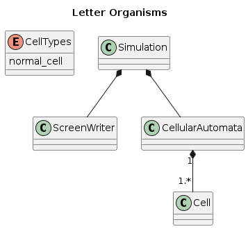

# Letter Organisms
Ascii-based artificial evolution and life form simulator

First idea is to try creating a working terminal application using carbon programming language.
After that I will try to build a basic cellular automata,
and later a cellular automata awith different types of cells, organisms consisting of multiple cells and evolution.

